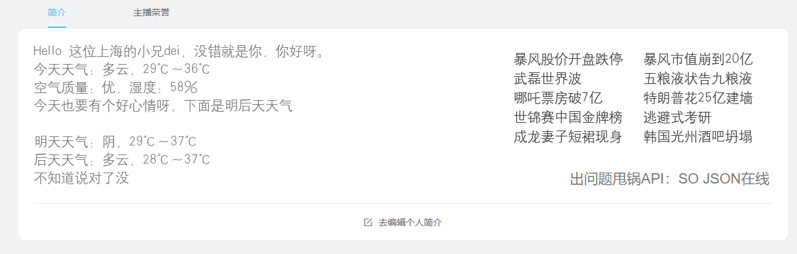

# 天气预报和热点新闻

天气预报的原理是根据IP地址获取地理位置，再根据观众当前位置获取天气。
热点新闻是PHP的Curl获取百度热点的网页，在用正则表达式把标题和链接匹配到，把链接存入cookie，简介页面的超链接用GET传值区分每个新闻，再从cookie中取出链接并跳转。

# 文件

- `c_code.php`：城市名对应的城市ID
- `dx.ttf`：生成图片需要的字体
- `news.php`：获取新闻
- `p.php`：获取天气

# 教程

把所有文件放在可以运行PHP的服务器上，网页中的图片或背景链接写上相应的地址，比如新闻的就是`http://xxx.com/news.php`。
如果你想做成点击打开，你需要GET传值，比如`http://xxx.com/news.php?u=0`，做出0-7的超链接，分别定位到图片的文字位置，就实现了点击打开。
